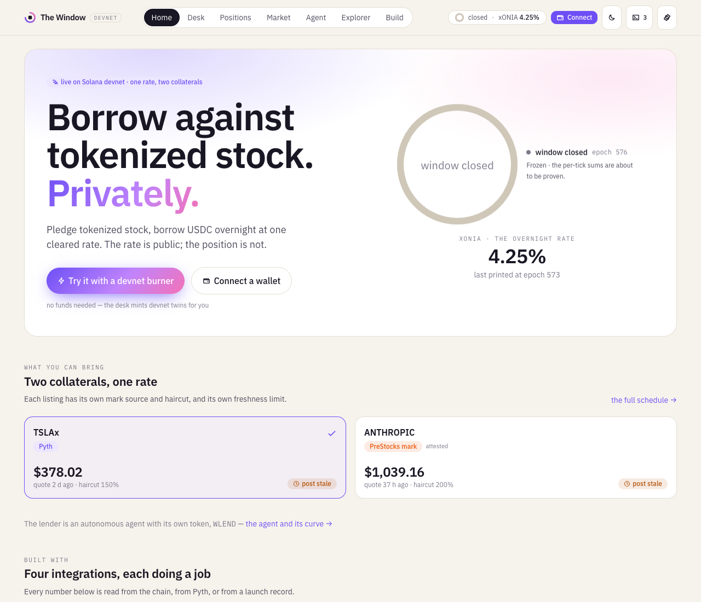
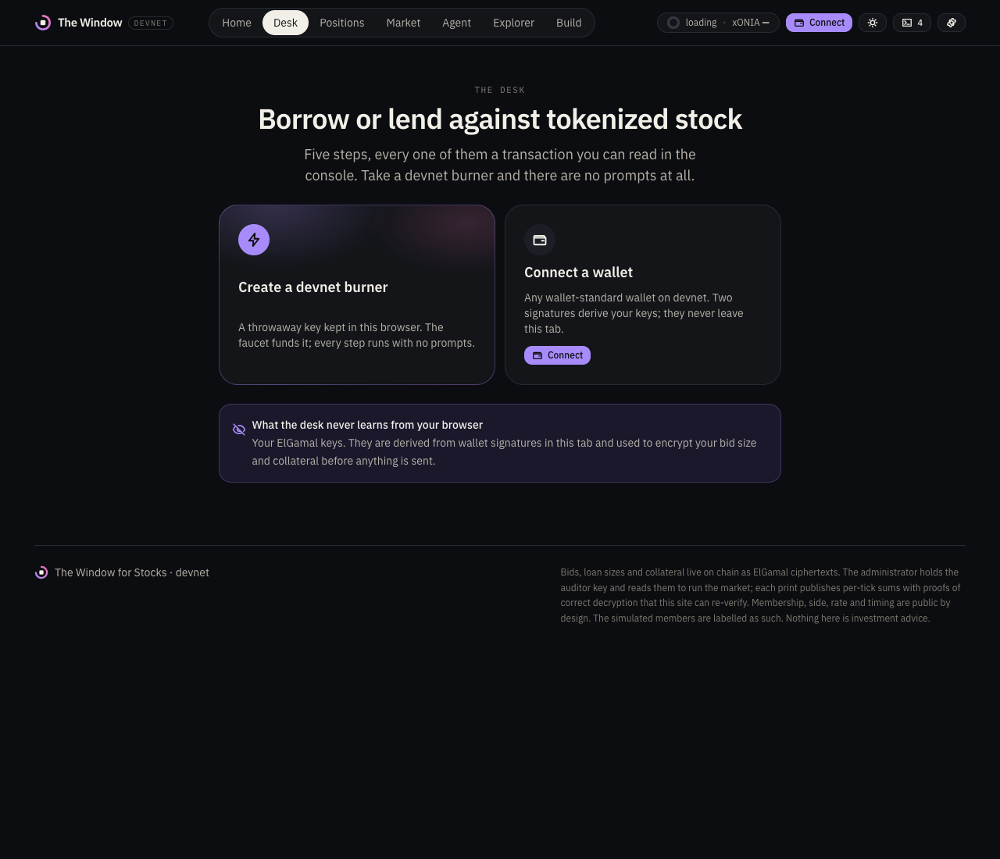
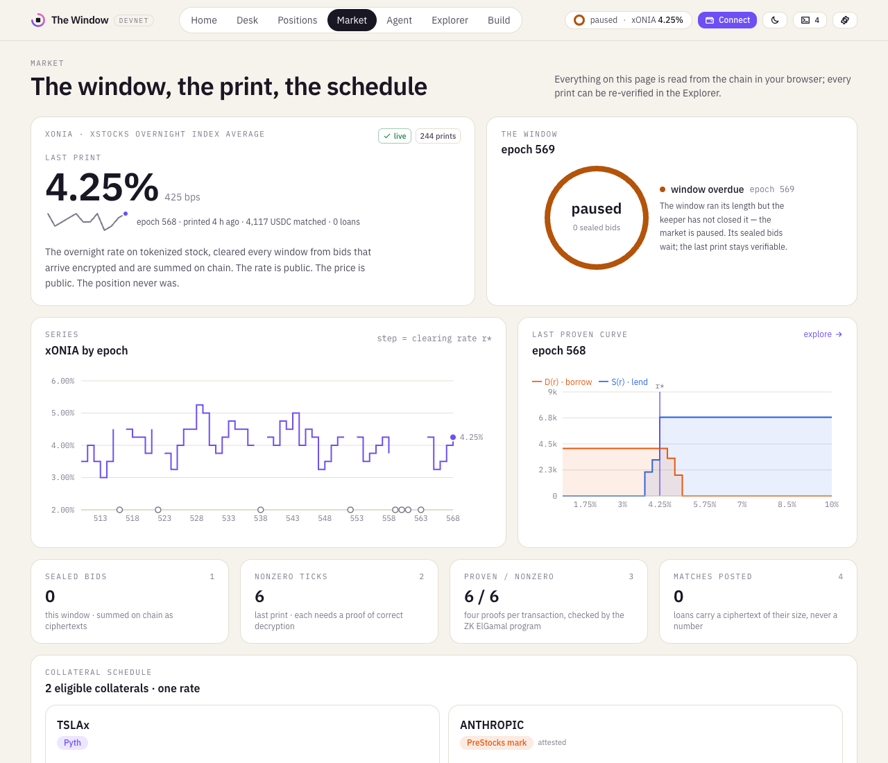
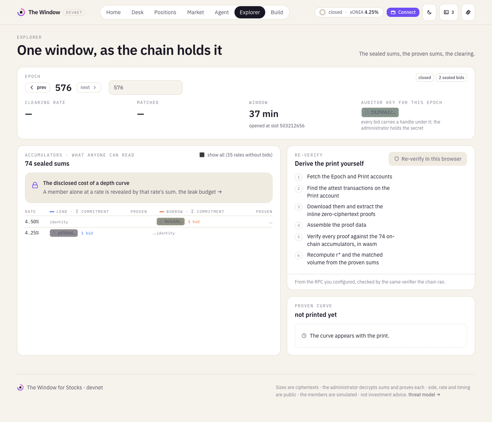
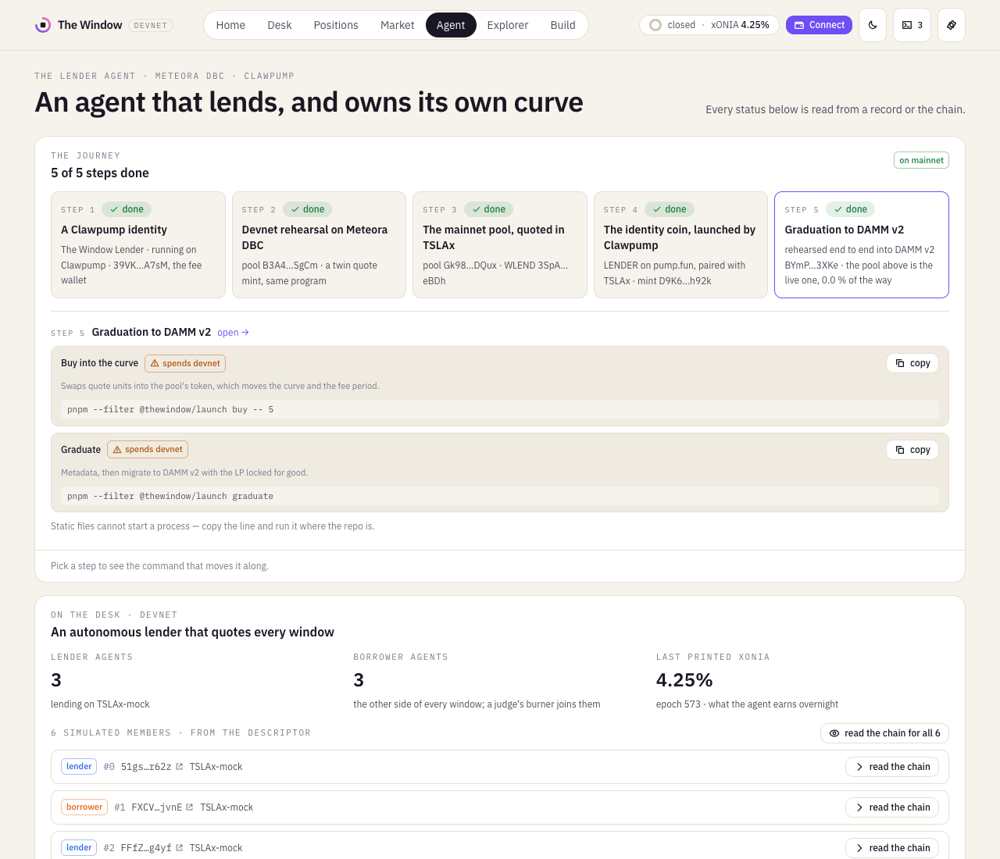
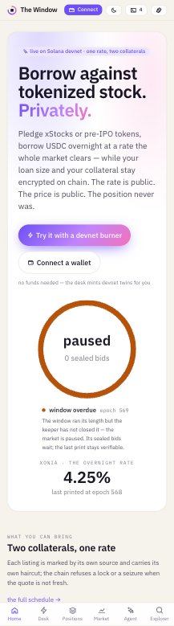

# THE WINDOW for Stocks

**A private margin desk for tokenized stocks on Solana.**

Encrypted collateral and bids in Token-2022 Confidential Balances, homomorphically summed on-chain,
cleared by an accountable administrator whose decryption is proven on-chain every print. Collateral
solvency is proven against the public Pyth price — with the corporate-action multiplier inside the
proof — without ever revealing the position. The output is **xONIA**, the xStocks Overnight Index
Average: the first on-chain borrow rate for tokenized equities.

> The rate is public. The price is public. The position never was.

| | |
|---|---|
| Specification | [`docs/SPEC.md`](docs/SPEC.md) (frozen) · [`docs/SPEC_AMENDMENTS.md`](docs/SPEC_AMENDMENTS.md) (what changed while building, and why) |
| Build plan | [`docs/BUILD_PLAN.md`](docs/BUILD_PLAN.md) — phases, gates, verified toolchain |
| Tracks | [`docs/TRACKS.md`](docs/TRACKS.md) — Pyth · PreStocks · Meteora DBC · Clawpump integration record, with the diagram [`docs/tracks.excalidraw`](docs/tracks.excalidraw); the whole-product map [`docs/project.excalidraw`](docs/project.excalidraw) — every program, instruction, proof, service loop, SDK module, page, test tier and track, status-badged (`pnpm docs:diagrams` regenerates both); [`docs/PYTH.md`](docs/PYTH.md) — what the Pyth quote does and how its age is enforced; [`docs/LISTINGS.md`](docs/LISTINGS.md) — the collateral schedule; [`services/launch`](services/launch) — the lender agent's token on a stock-quoted Meteora bonding curve |
| Status | **Live on devnet** — five programs, a market printing xONIA, and a dashboard that re-verifies each print in the browser: **<https://kaustubh76.github.io/Blinds/>**. Addresses and a walkthrough: [`docs/DEMO.md`](docs/DEMO.md) §C. Tier-1 suites (e2e, 32 attack cases in 11 files, invariants, privacy, measurements) run on Agave 4.2 via LiteSVM; tier-2 runs the dashboard's own code path against a real `solana-test-validator` with the real services. |
| Demo | [`docs/DEMO_SCRIPT.md`](docs/DEMO_SCRIPT.md) — the 2–3 minute live walkthrough: pre-flight, what to click, what to say, what to do when a window is closed, and the questions judges ask |
| Runbook | [`docs/RUNBOOK.md`](docs/RUNBOOK.md) — judging day: budget, start/watch/stop, the share link, what to do when something fails |
| Honest-claims rule | Never "trustless", "undecryptable", "nobody can see". The administrator **can** decrypt individual amounts. The public sees aggregates, the price, and the rate — each proven or publicly attributable. Enforced by `scripts/check_claims.sh` in CI. |

## What you see

| | |
|---|---|
| [](docs/screens/home.png) | [](docs/screens/desk.png) |
| **Home** — the live window, the two collaterals with their marks and whether the chain would accept them right now, a borrow calculator you can play with before connecting, how it works. | **Desk** — take a devnet burner (no wallet, no prompts) or connect one; five guided steps with a progress rail, or the autopilot that runs them all. |
| [](docs/screens/market.png) | [](docs/screens/explorer.png) |
| **Market** — xONIA by epoch, the last proven curve, the collateral schedule, the Pyth mark beside the underlying equity, and the PreStocks mark with its implied price and basis. | **Explorer** — one window as the chain holds it, and the button that re-derives the print in your browser. |
| [](docs/screens/agent.png) | [](docs/screens/home-phone.png) |
| **Agent** — the lender agent: its journey from a Clawpump identity to a graduated pool, the Meteora curve set from the desk's numbers beside what the chain says, and its identity coin. | **On a phone** — the same pages, the same numbers; every card wraps rather than truncates. The tab bar is the nav on a tablet too, up to 1024 px. |

Light and dark themes (the header toggle, or `?theme=light|dark`); the same pages on a phone: [`docs/screens/home-phone.png`](docs/screens/home-phone.png).

## Layout

```
programs/   window_registry · window_auction · window_oracle · window_wrap · window_credit   (Anchor 1.1.2)
crates/     window-elgamal · window-clearing · window-proofs · window-proofs-wasm · window-client · window-config · window-testkit
services/   admin (Rust: administrator + keeper + operator + price poster, the simulated agents, /deployment + /join (rate-limited faucet) for the dashboard) · pyth-poster (Node: carries Pyth's signed update into Pyth's receiver on devnet so the Pyth listing can be priced from Pyth's own account) · launch (Node: the lender agent's token on a stock-quoted Meteora DBC pool, priced from Pyth, and its Clawpump identity)
sdk/        @thewindow/solana-sdk (TypeScript on @solana/kit 8; codama-generated clients; transaction plans; wasm proofs; print re-verification)
app/        dashboard (Vite 8 + React 19 + Tailwind 4; wallet-standard via @solana/react; a devnet burner, a
            developer console, an Agent page that runs the agents' own quoting strategy under your key, a Build page
            whose recipes take parameters, really send, show the JSON-RPC as curl and hand you an editable scratchpad;
            a backdrop that follows the window — sealed bids drift, a print converges and stamps — off under reduced
            motion, behind a preference, and off with `?motion=off`;
            `pnpm dev` refuses a stale sdk/dist via scripts/check-sdk.mjs; a dev-only bridge (app/vite/devBridge.mjs)
            lets the Agent page run this repo's own commands where there is a checkout to run them on)
tests/      window-tests (LiteSVM: e2e, attacks, invariants, privacy, measurements) · integration (real validator, real services, TS SDK)
config/     demo.toml · integration.toml · devnet.toml · prod.toml — the single source of market parameters
scripts/    market.sh · serve_app.sh · watch_tunnels.sh · localnet.sh · deploy_devnet.sh · upgrade_devnet.sh · freeze.sh
            check_claims.sh · check_lineage.sh · render_devnet_docs.py · tracks_diagram.mjs · schedule.ts · watch_epoch.ts
            leak_audit.ts · vercel/ (an RPC proxy) · smoke/ (headless drivers: routes, recipes, interactive, screens, judge path)
deployments/ devnet.json · localnet.json (the desk) · launch-<cluster>.json + launch-plan-<cluster>.json (the lender
            agent's pool and the plan it was built from) · launch-devnet-graduated.json (a finished rehearsal)
            · admin-url.txt · app-url.txt (what the hosted dashboard reads) · program-keypairs/ · external/
docs/       SPEC.md · SPEC_V2.md · SPEC_AMENDMENTS.md · BUILD_PLAN.md · TRACKS.md · tracks.excalidraw · project.excalidraw · PYTH.md · LISTINGS.md · toolchain.md · METHODOLOGY.md · THREAT_MODEL.md · DEMO.md · adr/
```

## Quickstart

```bash
# toolchain: rustc 1.98.1, solana-cli 4.2.1, anchor-cli 1.1.2, node 24, pnpm 10, wasm-pack — see docs/toolchain.md
make build              # anchor build + freeze IDLs into sdk/idl
pnpm install && ./scripts/build_wasm.sh && pnpm -r build   # SDK (codama clients + wasm proofs) and the dashboard
make test               # tier 1: crates + programs on LiteSVM (Agave's real runtime, in-process)
make test-integration   # tier 2: real solana-test-validator, real admin service + agents, driven through the TS SDK
                        # Linux x86_64: build the validator from source first (docs/toolchain.md, trap 12) — the
                        # prebuilt one refuses valid ZK proofs; `./scripts/localnet.sh probe` tells you in 30 s
make demo               # one full epoch on localnet with the DEMO profile
cd app && pnpm dev      # dashboard against localnet (docs/DEMO.md)
```

## Hosting the dashboard

**Live at <https://kaustubh76.github.io/Blinds/>** (and mirrored at
<https://the-window-for-stocks.vercel.app/>), published by `.github/workflows/pages.yml` on
every push to `main` (pnpm + Vite only; the browser proof engine `sdk/wasm` is committed, so no
Rust toolchain is needed). It reads the public devnet RPC by default; set a repository variable
`VITE_RPC_URL` to a dedicated endpoint to lift the browser rate limits, and the next push picks it
up. Nothing else is needed to *read* the market; to *trade* from the hosted site the admin service's
demo faucet must be reachable — see "The faucet from the hosted site" below.

The Vercel mirror is the same `app/dist`, pushed by `./scripts/deploy_vercel.sh` (production by
default, `preview` for a preview URL). It is a manual publish, not a git integration: it builds the
SDK and the app exactly as the workflow does, copies `deployments/admin-url.txt` and the RPC proxy
in beside them, and deploys `app/dist` with the project link in `app/.vercel`. Because that pointer
is a snapshot, a rotated faucet tunnel needs a redeploy — `WINDOW_VERCEL=1 ./scripts/watch_tunnels.sh start`
does it automatically, and a `?admin=<url>` link always overrides whatever the host has baked in.

**A blank page is now impossible to misread.** Everything the dashboard shows is derived from chain
reads and from browser state — saved RPC and faucet settings, a burner key, wallet extensions that
inject themselves into the page — so a failure is often specific to one visitor and invisible
everywhere else. Two nets catch it: `app/index.html` carries a static panel that reveals itself when
the app has not mounted (a module that will not load, a script an extension blocked) and names the
failing request, and `app/src/components/ErrorScreen.tsx` catches a crash during render, prints the
error and offers to clear this site's saved settings. Both offer a reload; neither touches the
chain. `ErrorScreen.test.tsx` covers the boundary; the module-404 path is driven in a real browser.

**Why the mirror proxies its reads.** The public devnet endpoint rate-limits per client IP, and the
desk's own services (keeper, operator, six agents) saturate that quota from the machine running the
market: a browser on that network was losing ~45 % of its `getMultipleAccounts` reads to HTTP 429,
so panels filled in slowly or sat at "—". The Vercel build therefore points `VITE_RPC_URL` at
`/api/rpc` (`scripts/vercel/api/rpc.mjs`): a serverless function that forwards JSON-RPC from
Vercel's egress instead of the visitor's, retries the 429s that remain, and holds read replies for
`RPC_CACHE_MS` (1.2 s by default) so repeated reads across visitors cost one upstream call. Writes
are never cached. Set `RPC_UPSTREAM` in the Vercel project to use a dedicated endpoint — the key
stays server-side and never reaches the bundle. Subscriptions are unaffected: the proxy is HTTP
only, so the app keeps its WebSocket straight to the cluster (`VITE_WS_URL`). GitHub Pages has no
serverless layer, so it still reads the public endpoint directly; `?rpc=<url>` overrides either.

### The faucet from the hosted site

Admission is admin-gated on chain (spec §7.1), so a new wallet is admitted and funded by the admin
service's `POST /join`. While the market runs, that service is exposed through a Cloudflare quick
tunnel (`brew install cloudflared` once):

```bash
./scripts/market.sh start      # …also prints:  share  https://kaustubh76.github.io/Blinds/?admin=https://<x>.trycloudflare.com
./scripts/publish_admin_url.sh # optional: commit deployments/admin-url.txt so the hosted app finds the faucet without the link
./scripts/market.sh stop       # closes the tunnel and clears the pointer
```

The `?admin=` link configures that browser once (it is persisted and stripped from the address
bar); the Settings sheet (gear) shows and edits it. The faucet funds a wallet once, at most
`WINDOW_JOIN_MAX_PER_HOUR` (30) wallets an hour, and never below `WINDOW_JOIN_MIN_BALANCE_SOL` (0.5).

### For developers

The hosted dashboard is built to be hooked into, not just looked at:

- **A devnet burner wallet** — one click creates a throwaway key in the browser (a Wallet Standard
  wallet, so every flow runs with no extension and no prompts); the Desk's **Autopilot** then runs
  derive → join → set up → wrap → bid in one go. Extension wallets still work.
- **The console** (`` ` ``) — every SDK call the page makes as copyable TypeScript with the live
  arguments (wallet signatures and bid openings are never rendered), every transaction with an
  inspector (logs, compute units, programs), the window's phase changes, and the programs' events
  decoded as they arrive over the WebSocket.
- **Agent** (key 5) — the lender agent: its journey to a token on mainnet, the Meteora curve set from the
  desk's numbers, its Clawpump identity and coin; Home's "built with" strip and the Market's PreStocks card
  are the other two integration surfaces.
- **Build** (key 7) — recipes that run in the tab against the configured RPC and copy as code
  (read the market, the last print and its curve, re-verify a print, your membership and loans, a
  bid plan dry run, subscribe to events); the five programs' instructions, accounts, events and
  errors from their IDLs; PDA seeds; the app's hooks; the admin service's API.
- **`window.thewindow`** — the SDK, the RPC client, the config, the console store and the query
  client, on the page for DevTools.
- **Runtime settings** — `?rpc=` `?ws=` `?admin=` on any link, or the Settings sheet, point the
  hosted app at your own endpoints or a local validator.

The app also deploys to Vercel as-is (`app/vercel.json`; rehearsed from a clean clone with
`NODE_ENV=production`):

1. In Vercel, **Add New → Project → Import** `kaustubh76/Blinds` (the repo is public; if you fork it private, grant the Vercel
   GitHub app access to it, or make the repo public).
2. **Root Directory:** `app`. Framework and commands are read from `app/vercel.json` — leave them.
3. **Environment variables** (Production):
   - `VITE_CLUSTER` = `devnet`
   - `VITE_RPC_URL` = a devnet RPC endpoint you control (Helius, QuickNode, Triton… free tiers are fine).
     `https://api.devnet.solana.com` works but rate-limits browsers hard; don't ship it to judges.
   - `VITE_ADMIN_URL` = *only* if the Desk's demo faucet should be live: the public URL of the admin
     service (`./scripts/market.sh start`, port 9090, exposed through a tunnel). Leave unset otherwise —
     Market, Explorer and Positions read the chain directly and never need it.
4. **Deploy.** Put the resulting URL on the first line of `deployments/app-url.txt` and run
   `python3 scripts/render_devnet_docs.py` so `docs/DEMO.md` points judges at it.

## Privacy, enforced

"The position never was" is a tested property, not a slogan. No instruction of the five programs
takes a size; sizes exist on-chain only as ciphertexts; no event carries an amount; and a leak-audit
test scans every account, every transaction and every log of a full epoch and two loans for the
plaintext of every secret quantity. The same audit runs over RPC against the real validator after the tier-2 lifecycle. The leak
budget — what *is* public and why — is in [`docs/METHODOLOGY.md`](docs/METHODOLOGY.md) §6 and
[`docs/THREAT_MODEL.md`](docs/THREAT_MODEL.md).

## Measurements

Measured on Agave 4.2 (LiteSVM 0.16) by `cargo test -p window-tests --test measurements`; `attest_batch = 4`.
The programs are compiled `opt-level = "z"` because `programdata` rent is paid once and permanently at
deploy (1,252,952 B ⇒ 6.37 SOL on devnet; `make size`): that trades 11–26 % more compute units for
0.58 SOL and leaves transaction counts and sizes — the binding constraints — unchanged (amendment A12).

| Path | Transactions / size | Compute units |
|---|---|---|
| `submit_bid` (validity inline + range context) | 769 B / 1,141 B | 37,035 + 111,000 |
| `attest_ticks`, 2 inline PoCDs (gate) | 768 B | 30,448 |
| print, 1 nonzero tick | 3 tx · ≤ 561 B | 87,906 |
| print, 10 nonzero ticks | 5 tx · ≤ 1,182 B | 202,167 |
| print, 37 nonzero ticks | 12 tx · ≤ 1,182 B | 545,810 |
| print, 74 nonzero ticks (worst case) | 21 tx · ≤ 1,182 B | 1,018,228 |

## Amendments to the specification

The mechanism in `docs/SPEC.md` is frozen; §7 and §12 change only by written amendment. The
amendments A1–A15 (transaction-size-driven print batching, bid PDAs, corrected solvency units, how
Token-2022 confidential deposits actually work, escrow signer reality, loan ciphertext handles, the
`ScaledUiAmount` multiplier, zero-copy accounts, the fresh-build guarantee, and the zk-sdk 7 proof line) are recorded with
evidence in [`docs/SPEC_AMENDMENTS.md`](docs/SPEC_AMENDMENTS.md).

## Honest limitations

The project must not claim any of the following.

- **"Trustless" / "undecryptable."** The Benchmark Administrator holds the auditor key and can decrypt every individual bid, loan, and balance. The claim is *accountable* privacy: the public sees aggregates, the price, and the rate, and every published aggregate is proven.
- **Participation privacy.** Member keys, ticks, and timing are public. Hiding *who* participates is a post-hackathon extension, not a delivered property.
- **Mock collateral.** Devnet cSTOCK-W wraps a mock xStock mint that mirrors the real assets' Token-2022 extension layout (including the rebasing multiplier). No real xStocks are touched; mainnet wrapping of real xStocks is roadmap.
- **Keeper-attested price, or Pyth's own account.** Under `price_source = 0` the Pyth price enters via a keeper-posted cache attested against a named public 24/7 feed (feed id and publish time on-chain for anyone to check). Under `price_source = 4` (A15, deployed) the program reads Pyth's receiver-owned `PriceUpdateV2` account itself — no keeper copy in the path; flipping the devnet listing to it needs a Pyth key for the poster (`docs/TRACKS.md`, Stage 4). The multiplier is read from mock-mint state the team controls on devnet.
- **No intra-tenor margin calls.** Overnight tenor + 150% haircut + deadline seize only. The haircut is illustrative, not risk-calibrated.
- **Funding magnitude attested.** `confirm_funding` and `repay` are administrator attestations after decrypting the transfer's auditor ciphertext; the program enforces lifecycle finality, not transfer size.
- **Custody with the operator.** A PDA cannot generate confidential-transfer proofs, so escrow sits in the operator's confidential account. Authority on-chain; custody not.
- **One key.** Administrator, keeper, operator, and price poster are one disclosed key in this deployment; the separation exists in program design, not operations.
- **Simulated members.** Auction depth comes from scripted bots operated by the team, labelled "simulated" everywhere; the judge-usable borrow flow is real but not organic demand.
- **Not a regulated benchmark; not a broker.** xONIA is a devnet reference rate; the SOFR/SONIA comparison is governance shape only. Nothing here is investment advice or a brokerage service.
- **Platform dependency.** The mechanism depends on the ZK ElGamal Proof program and curve25519 syscalls; if disabled, prints and credit stop.
- **Research deferred.** The behavioral experiment (bid shading under transparency vs. encryption) is not run for this submission.
- **Unaudited. Single tenor. Do not custody real value.**

## License

MIT — see [`LICENSE`](LICENSE).
